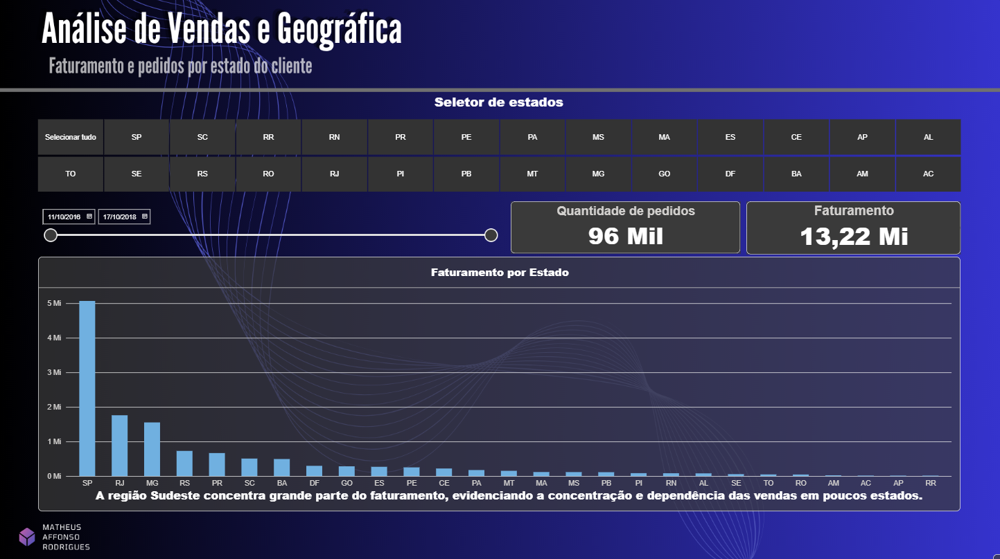
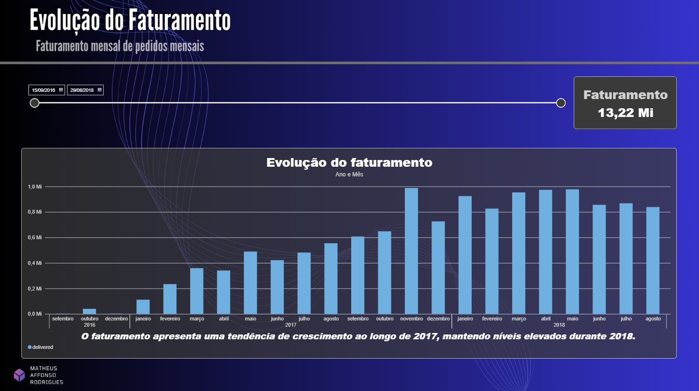
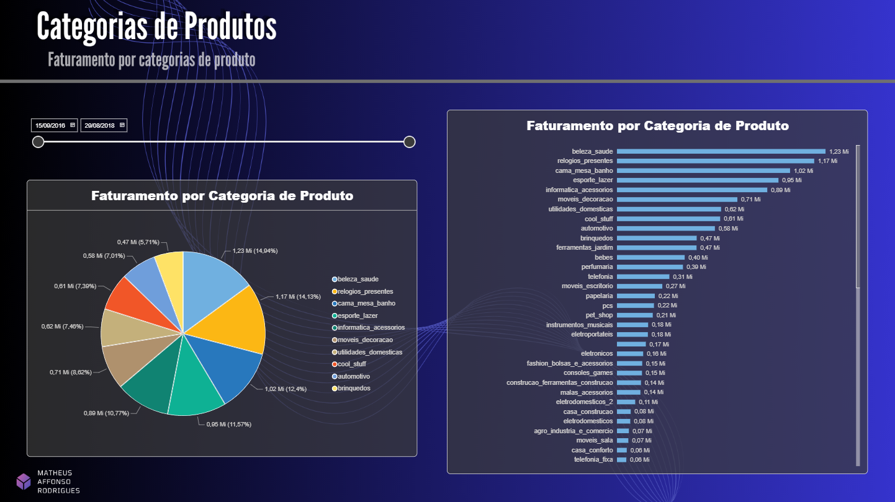
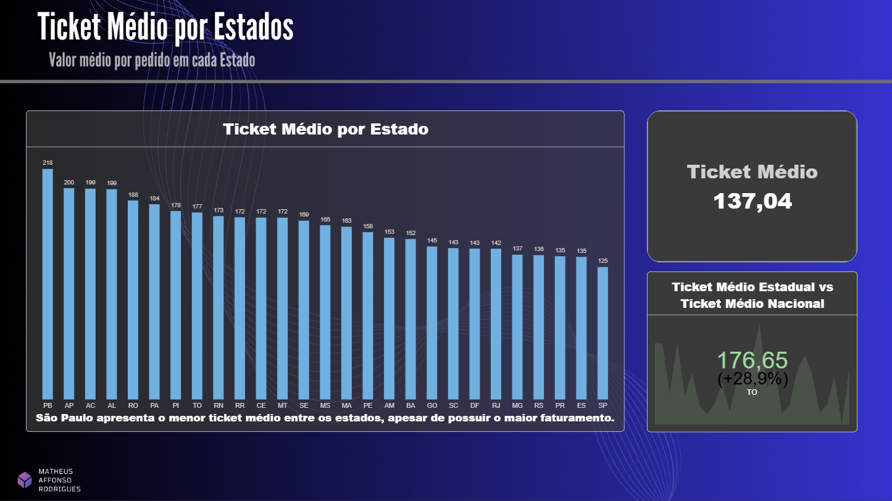

# Análise de E-commerce Brasil — Power BI

Dashboard desenvolvido em Power BI para análise do desempenho comercial do e-commerce brasileiro a partir do dataset público da Olist.

O projeto busca transformar dados transacionais em informações relevantes para a tomada de decisão, explorando aspectos como distribuição geográfica das vendas, evolução do faturamento, desempenho das categorias de produtos e comportamento do ticket médio entre os estados.

---

## Principais Análises

### 1. Análise de Vendas e Distribuição Geográfica

Esta análise busca compreender como as vendas e o faturamento estão distribuídos geograficamente entre os estados brasileiros.

**Perguntas analisadas:**
- Quais estados concentram o maior faturamento?
- Como os pedidos estão distribuídos pelo território brasileiro?
- Existe concentração relevante das vendas em determinadas regiões?

**Insight**

A concentração do faturamento no Sudeste revela uma dependência relevante de poucos mercados regionais. Embora essa concentração possa estar associada à maior densidade de consumidores e à infraestrutura logística da região, ela também aumenta a exposição do negócio a oscilações de demanda nesses mercados. A expansão para outras regiões pode representar não apenas uma oportunidade de crescimento, mas também uma estratégia de diversificação da base de receita.

---

### 2. Evolução do Faturamento

Esta análise acompanha o comportamento do faturamento ao longo do período analisado, permitindo identificar tendências de crescimento e períodos de maior ou menor atividade comercial.

**Perguntas analisadas:**
- Como o faturamento evoluiu ao longo do tempo?
- Existem períodos de crescimento ou retração?
- O crescimento das vendas apresenta um comportamento consistente?

**Insight**

A evolução do faturamento indica uma trajetória de expansão ao longo do período analisado, sugerindo ganho de escala da operação. Entretanto, crescimento de receita, isoladamente, não representa necessariamente aumento de rentabilidade. A manutenção dessa expansão depende da capacidade de sustentar o volume de vendas sem comprometer margem, custos logísticos e eficiência operacional.

---

### 3. Categorias de Produtos

A análise de categorias permite avaliar a composição do portfólio e identificar quais segmentos apresentam maior participação no faturamento.

**Perguntas analisadas:**
- Quais categorias apresentam maior faturamento?
- Como o desempenho está distribuído entre as diferentes categorias?
- Existe concentração relevante da receita em determinados segmentos?

**Insight**

O desempenho das categorias evidencia uma concentração relevante da receita em determinados segmentos do portfólio. Essa concentração pode favorecer a eficiência comercial ao direcionar esforços para categorias de maior demanda, mas também aumenta a exposição do negócio caso o desempenho desses segmentos se deteriore. A diversificação do mix, combinada à identificação de categorias com potencial de crescimento, pode reduzir essa dependência sem necessariamente comprometer os produtos líderes.

---

### 4. Ticket Médio por Estado

Esta análise compara o ticket médio entre os estados brasileiros, permitindo observar diferenças no valor médio das transações e sua relação com o volume de vendas.

**Perguntas analisadas:**
- Quais estados apresentam maior ticket médio?
- Estados com maior faturamento também possuem maior valor médio por pedido?
- Como o comportamento do ticket varia regionalmente?

**Insight**

São Paulo combina elevada participação no faturamento com um ticket médio inferior ao observado em outros estados. O contraste indica que sua liderança em receita é sustentada principalmente pela escala de pedidos, e não por um maior valor médio por transação. Esse comportamento sugere uma oportunidade de investigar estratégias de aumento de ticket, como cross-selling, composição de kits e recomendação de produtos complementares, especialmente em mercados de alta frequência de compra.

---

## Ferramentas

- Power BI
- Power Query
- DAX

---

## Fonte dos Dados

**Olist Brazilian E-Commerce Dataset**

Dataset público contendo informações sobre pedidos, clientes, produtos, pagamentos, avaliações e demais aspectos das operações de um marketplace brasileiro.

---

## Projeto Relacionado

Este projeto dá continuidade à análise exploratória do e-commerce brasileiro desenvolvida anteriormente utilizando SQL e Python.

**[Ver projeto de análise exploratória →](https://github.com/matheus-affonso/brazilian-ecommerce-analysis)**